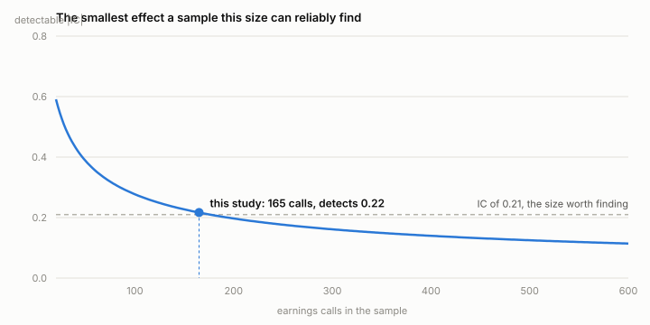
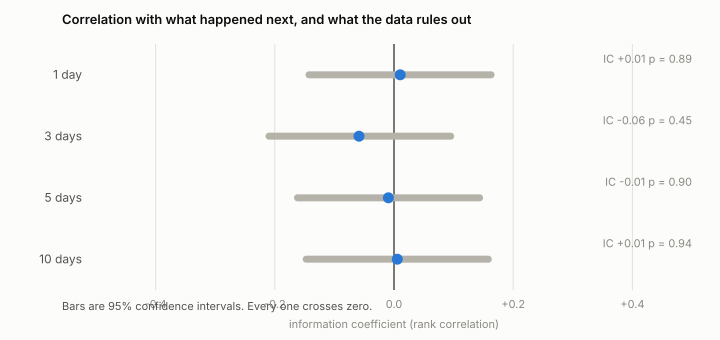

# How many earnings calls would it take to know if tone predicts returns?

Executives answer analysts unscripted for half an hour, and the tone of those answers might carry something the market hasn't priced yet. Any effect like that would be small, and small effects need a lot of calls before they show up at all. So I tried to quantify how many.

I started by taking 165 earnings calls and tested how strong a return signal I could get from the tone of the Q&A. At that sample size, the test can only reliably detect a correlation of 0.22 or larger. To have a realistic shot at seeing a signal worth trading, the sample would need to be roughly 3,100 calls.

The 165 measured result, nothing of value: IC -0.009, p = 0.90.

<picture>
  <source media="(prefers-color-scheme: dark)" srcset="docs/figures/power-curve-dark.svg">
  
</picture>

## Overview

- Parsed 174 PDF transcripts into speaker turns, tagged with timestamps, who was talking, and what their role was
- Scored only the Q&A, turn by turn, because prepared remarks are written days ahead by the investor-relations team
- Measured drift over the following days rather than the jump on the day, stripped out the market, and scaled by each stock's own volatility
- Fixed the headline test and the power calculation before running the model for an honest result
- 77 tests, design decisions written up in [docs/adr](docs/adr/).

## How it works

Four distinct steps:

**Score the right part of the call.** Prepared remarks are drafted in advance and read aloud, so their tone measures the IR team's writing, not the business. Only the Q&A is worth scoring. Finding where it starts is harder than it sounds, and getting it wrong quietly wrecks the result — see below.

**Score turn by turn.** FinBERT is a language model trained on financial text; it reads 512 tokens at a time, and a Q&A session runs to twenty thousand words. So each speaker turn is scored separately and the call's score is the average. Turn scores are cached, which means every alternative way of combining them costs nothing to try.

**Measure the right thing.** The price jump when results are announced is gone in seconds and isn't tradeable from a transcript you read afterwards. So the target is *drift*: what the stock does over the following 1, 3, 5 and 10 days, starting from the close of the day after the call. The market's own move is subtracted out, and the result is divided by the stock's volatility so a quiet name and a jumpy one count equally.

**Ask whether the answer means anything.** The measure is the information coefficient, or IC: the rank correlation between what the score predicted and what actually happened. Zero is no relationship. An IC of 0.05 sustained across a wide universe is a genuinely useful signal in practice. The catch is that small samples can't see small effects, so before running anything I worked out what this one could see: 0.22. Anything smaller would be invisible here whether it exists or not.

## Results

### What the sample could detect

A correlation has to clear a noise floor set by how many calls you have. Fisher's transform makes that floor explicit: an IC is roughly normal with standard error `1/sqrt(n-3)`, so the smallest one a test catches 80% of the time at 5% significance is

```
IC_min = tanh( (z_0.975 + z_0.80) / sqrt(n - 3) )
       = tanh( 2.80 / sqrt(n - 3) )
```

At n = 165 that is `tanh(2.80 / 12.73)` = **0.217**. Rearranged, it answers the question in the title:

```
n = 3 + ( 2.80 / artanh(IC) )^2
```

A signal worth trading sits nearer 0.05, which needs **3,138 calls** — nineteen times the sample I had. Everything below is measured against that floor.

### What it measured

The headline test, fixed in advance: mean turn sentiment against 5-day drift.

```
IC -0.009    95% CI [-0.162, +0.144]    p = 0.90    n = 165
```

That's a zero, and direction agrees: 48.5% called correctly against a naive 53.3% base rate.

Five days was not simply the wrong window:

<picture>
  <source media="(prefers-color-scheme: dark)" srcset="docs/figures/ic-by-horizon-dark.svg">
  
</picture>

Nor does it hide in a different average, or in one company:

| Cut | Result |
|---|---|
| Ways of averaging turns | word-weighted +0.03, management only +0.03, analysts only -0.05 |
| Per company | 3M is the largest at -0.25 (p = 0.10), which becomes p = 0.52 once corrected for testing five names |

The alternatives are listed because I ran them, not so the best one could be promoted. The plain mean was the headline before I saw any of it (see [docs/headline.md](docs/headline.md)).

None of these alternatives rules out an effect of the size that would actually matter. With a detectable floor of 0.22, a really large signal is needed.

## A bug I encountered

Two versions of the Q&A boundary would have failed silently if I did not review results at each step. The first parser looked for the operator's handover phrase. This phrase was also often used at the start, and so many whole transcripts were mixed into the dataset (79 of 174). I replaced it with a structural rule based on the first analyst turn. That is more reliable than matching a particular phrase, but it still drops 9 calls because their analysts aren't actually titled "Analyst".

Going into this project, I did not know what to expect from the number I was looking for, so both errors likely would produce plausible results. The pattern in the dropped calls is what exposed the second problem: 8 of the 9 are Stellantis half-year and full-year calls. The parser wasn't just losing a few random observations; it was losing a particular company and type of call. Both issues are now fixed, and every run reports how many calls were dropped and why.

## Limitations

- **Five companies, 165 calls.** The dataset covers 3M, Deere, Carnival, Alcoa and Stellantis from 2011 to 2026. That is a handful of names spread over a long period, not a broad cross-section. I sourced the PDFs manually from Quartr without access to their API; in hindsight this was a very inefficient method and I should have spent more time looking into alternative data sourcing options
- **Nine calls are still dropped** Their Q&A boundary cannot currently be located, and eight of the nine are Stellantis. The transcripts themselves parse correctly; it is the speaker identification that fails. Fixing that would recover those observations
- **No earnings-surprise control.** Tone tends to move with the size of the earnings beat or miss, so some of the relationship being measured could be the earnings surprise rather than the tone itself. I have not separated the two
- **FinBERT is used unchanged.** With fewer than 200 calls there is nothing to fine-tune on, and a train/test split would have cost most of the sample. [ADR 0001](docs/adr/0001-no-fine-tuning.md).

## What I'd do next

Widen the universe before anything else; nothing here is worth refining at n=165. After that, sector-neutralise the returns, control for the earnings surprise so tone is measured on top of it rather than alongside it, and walk the test forward in time instead of pooling.

## Running it

Requires Python 3.11+. Transcripts are licensed and not included.

```
pip install -e ".[dev]"
pytest                                    # 77 tests
python -m experiments.build_dataset --parse --pdf-dir transcripts_pdf_archive
python -m experiments.score               # the only slow step, resumable
python -m experiments.headline
python docs/figures/power_curve.py        # README figures
python docs/figures/ic_by_horizon.py
```

`score` caches every call as it finishes, so stopping it costs nothing — it picks up where it left off. Design decisions are in [docs/adr](docs/adr/).
